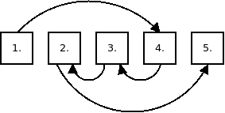
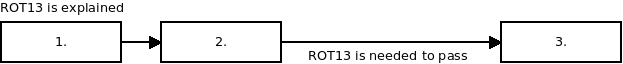
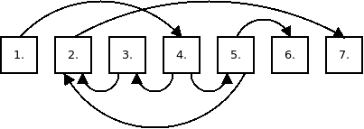
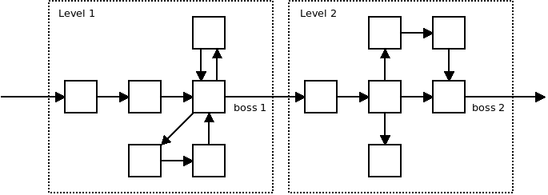

# Crypto for Kids (A Book that is a Labyrinth)

This project is a dumping ground for texts that will one day form a cryptography book for kids.

The target age group is 11+. According to Piaget, kids in concrete operational stage, aged 7-11, learn to understand a perspective other than one's own. Once they are done with that the door is open to understanding cryptography which, by it nature, is about conflicts between perspectives of different people.

The goal of the book is to avoid as much technical detail as possible and focus on basic principles and the kind of twisted thinking needed for cryptography. As such the book will also touch adjacent subjects such as game theory, psychology, maths, economics, history, opsec, stage magic, you name it.

The book itself is going to be a mystery, a puzzle, a labyrinth. It will be split into small pieces and the correct ordering of the pieces will be revealed only by solving little cryptographical puzzles.

One story may look, for example, like this: First, something impossible happens. Then the reader will be told: "How is that possible?" or "You now have enough information to solve the mystery yourself!" The final part of the story will resolve the mystery, but there's a catch. The reference to the final part will be encrypted, obfuscated or maybe steganographically hidden. To give a trivial example: "Continue reading at section 54 mod 7!"

Structuring the stories like this has an educational value. Namely, if you want to teach something to someone, exercises are needed. But people tend to skip exercises. I, for one, do. This way the reader will be forced to do the exercise to be able to continue reading.

The system also enforces the rules of the game. The reader cannot skip stuff or start reading from the middle.

First, you cannot pick a chapter and find the previous one. Technically, this works like a one-way function. Given that the chapters are unordered and the only link between two subsequent chapters is a command at the end of the first chapter (e.g. "Go to section 135!") you would have to search through the entire book to find the previous chapter. But even if the book is digitalized and allows for automated searching, looking for "135" is not going to find anything if the command is "Go to section 324 mod 189!". 

Second, picking a chapter from the middle of the book and trying to move forward is not going to work. Specifically, if the puzzle at the end of the chapter requires a skill that wasn't taught in that chapter, there's no way to find the next chapter.

The picture below shows how, starting reading from chapter 99 it's impossible to move either forward or backward:

To prevent reader from just reading the entire book some confusing and/or boring pulp should be added. The content of the pulp should not be easily distinguishable from the regular content. Old news articles, letters, accounting statements, fragments of boring novels, nonsensical diagrams and so on. These sections won't be linked from the regular content, but they may be linked together. The puzzles in these pages can be unsolvable or can even make no sense at all. From education standpoint, the reader embarking on the mission to read the entire book will live through an authentic the "sifting through a lot of stuff" experience, perhaps landing on an interesting bit here and there.

As a side effect, the "hyperlink" structure of the book makes it possible for the book to be non-linear. Think of the fictional book discussed in Borges' _The Garden of Forking Paths_. Or, to pick a real book, Pavić's _Dictionary of the Khazars_. If the idea is taken into extreme it won't be possible to read the book without drawing a map, as you do when playing Dungeons & Dragons.

As for the concrete mechanism, a path split corresponds to a chapter with two puzzles. There's even a neat trick to randomize the splitting. Imagine, for example, that there's a single puzzle in a chapter, a sudoku. After solving it you should continue to the chapter pointed to by the number in upper right corner of the sudoku square. However, unbenknownst to the reader, the sudoku has two possible solutions, each resulting in different number in the upper right corner.

A joining of the paths, on the other hand, doesn't require anything special. All that's needed is for two puzzles in different chapters to point to a single chapter. This mechanism should be used cautiously though as it means that sometimes the reader is going to solve the puzzle and arrive at an already visited place. This element of disappointment may be desirable at small doses but if overdone, it will ruin the game experience. Often, it may be better to have dead-end side branches rather than cycles.

While the above primitives provide a tool to build a labyrinth of any kind, the question is what type of labyrinth we want to actually build. And given that the entire project is, in its essence, a game, the form of the labyrinth should be guided by a sound game design.

The simplest way to do that is to separate the book into multiple "levels". Each level will teach particular set of skills. Those skills will then be needed to defeat a "boss", i.e. a particularly hard puzzle, that gates the way to the next level:

Another thing to be learned from game design is that being said how to play the game spoils all the fun. The players should discover stuff by themselves. Therefore, there will be no sheet with the rules. Let kids experience the feeling of dealing with a mysterious artifact, devised by adversarial intelligence to confuse them. Even false leads can be added to make the entire enterprise more entertaining.

Yet one more thing to focus on is correct pacing of stories and puzzles. The story should be a reward for solving a puzzle. It should be reasonably long to be an actual reward, but not overly long which would make the entire project less of a game and more of a plain old-school book.

Finally, the story should, at the edges, blend to the real world. Example: "This is Voynich manuscript. It's scanned and posted online. Go and decypher it if you dare." Different example: "This is the history of cryptography. By the way, there's such a thing as CCC. Go and attend if you will." The idea to communicate here is: The thread that stretches from the dawn of time and passes through Caesar, Trithemius and Alan Turing ends in your hand today.

### Notes

1. The rationale for excluding maths: The average reader is not likely to be involved in crypto primitive design, ever. As the primitives get better they become more like Lego blocks. You never make Lego blocks yourself. They are done by few experts in a Lego factory. It may be interesting to know how they are made but you don't have to to play with the bricks.
2. I definitely want the book to by printed in some XVII. century typeface. That seems to be a good compromise between keeping it readable while at the same time mysterious and weird. Also, the number of topics covered and unconnectedness of the different stories gives it a distinct baroque feel (think _Anatomy of Melancholy_) so the font should reflect that.
3. In such a convoluted book, pictures are natural focus points. This gives a possibility to attract attention of the reader to read particular sections in out-of-order manner. Which may be desirable in some cases. Where it is not, we can still put the picture in a separate section with no accompanying text. The section that references it will be hard to find, so such stand-alone pictures will make casual thumb-throughers only more confused.
4. One fun option: The story wanders of to the Internet at some point. Then returns back to the book after a while. That, in turn, allows for playing a stage magic trick: The reader is, at this point, accustomed to how the printed book works. They will expect that the chapters on Internet will be similar. Wrong! The Internet can do different kinds of things, like showing a different chapter to different people. Showing particular text only on special occassions, like when moon is full, and so on.
5. Another fun option. The epilogue will not be linked from anywhere. It will say: "Congratulations for finishing the book! But wait! You've cheated! (But remember, cheating is a strategy!)" There would have to be some clues to guide the reader to the epilogue. First section of the epilogue would be the last section of the book. Conspicious picture to mark it. Or something in that vein.
6. Unsolved problem: How to do references? It would be nice if, say, Messager's story had a reference to "perfect secrecy" and "Claude Shannon", so that interested readers would have keywords to search for on the Internet. On the other hand, providing references can make the book less mysterious and readers could cheat when solving the puzzles by looking at the reference material instead of thinking themselves.

Rendered version of the text: <https://sustrik.github.io/crypto-for-kids/>

If you want to participate in writing this book, please drop me a note at `sustrik@250bpm.com` or simply open a pull request.

**All the text is licensed under Creative Commons Attribution 4.0 International Public License.**
