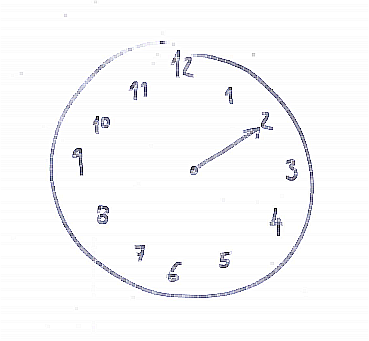

**Explain the modulus operation.**

[[[name:modulus-1 section:5

Imagine it's two o'clock. What will be the time in five hours?

Seven o'clock, right? It's easy. 2 + 5 = 7.

But here's a trick question: It's ten o'clock. What time will it be in five hours?

10 + 5 = 15, but there's no such thing as fifteen o'clock.

When the hand moves beyond 12 it's one o'clock again.

What we can do is to do the addition and then subtract 12 if the result is larger than 12: 10 + 5 - 12 = 3.

And here's a question for you: Imagine your friend calls you at 8:00am on Monday and says you are going to meet in 154 hours. On which weekday and exactly at which hour will you meet?

Once you've solved the problem take that time (the hours part) and multiply it by seven. Continue reading at that section.

]]]
