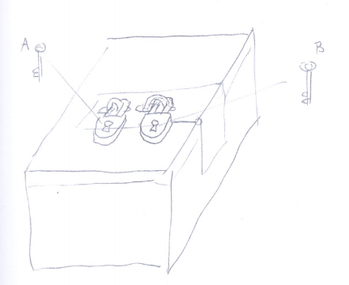
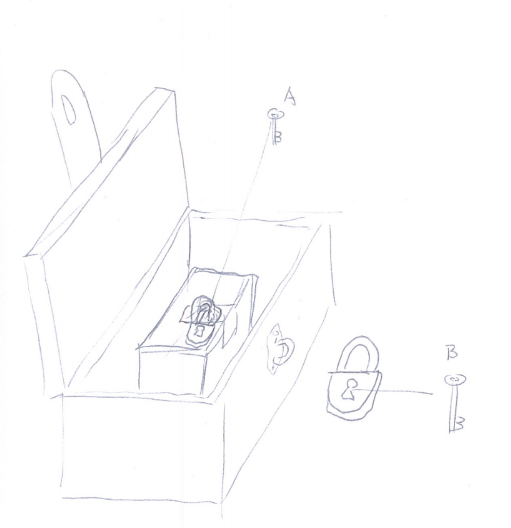
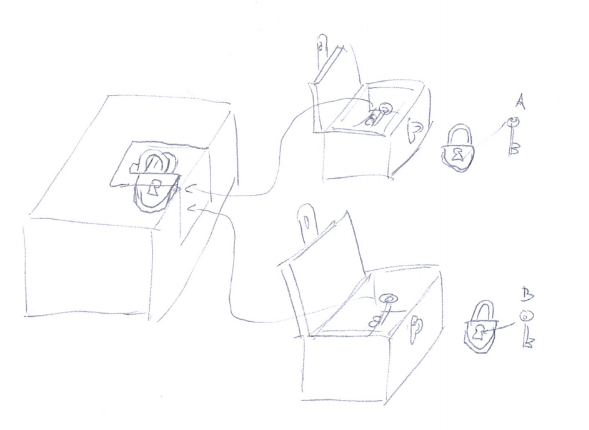

**Explain how a single message can be encrypted for multiple recients.**

The stories where some secret is so important that it is locked by sever locks and can be opened only if the seven people with the keys meet and agree on disclosing the secret.

I am too lazy to draw seven locks, but here's a picture with two locks:

Can we do a similar thing, but allowing ANY of the two people to open the box? Yes. Here's the picture:

In real cryptography you are likely to see a bit different arrangement though. If a crytographer wants a secret to be disclosed only if two people cooperate he'll probably encrypt it once, give the key to one person, then encrypt the result for the second time and give key to the another person:

What about the case when we want anyone from the selected group to be able to get the secret? We can encrypt it. Then encrypt the key using several other keys. Hand each of the secondary keys to one person:

Comment: This can be used to explain the concept of crypto primitives: Custom-made locks are fun but you have to go to the locksmith each time you need one. Prefab locks are less fun but they can be combined in any way you want.

