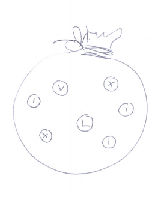

**Brief overview of factorization. Explain that it's considered to be a hard problem.**

By now you should be familar with roman numbers. They are used in this book quita a bit. They go like this: I, II, III, IV, V, VI, VII, VIII, IX, X ...

But that's not the only way to write them, in Roman times, and even later you could see an alternative spelling: I, II, III, IIII, V, VI, VII, VIII, VIIII, X ...

In fact, you can see number IIII on some clock dials even today.

One thing that's interesting about this alternative spelling is that you can rearrange digits in any way and you still get the same number. VII, IVI, IIV are all the same number, namely 1+1+5=7.

```
I = 1
V = 5
X = 10
L = 50
C = 100
D = 500
M = 1000
```

You can thus think of it as of bag of coins. Bag of 78 Roman denarii would look, for example, like this:



The coins are not ordered. In fact, they are being mixed all the time as you move. But despite that, the bag still contains the same amount of money. If you want to know how much money you own, you just pull the coins from the bag, one by one, and add the numbers together.

Now, here's a question: Can you do the same, but instead of adding the numbers, can you multiply them?

How would that work? Well, if you had 2, 2 & 3 in your bag, you'd multiply those numbers and voila, you own 2x2x3=12 Roman denarii.

...

FIrst 100 primes:

```
2	  3	  5	  7	  11	13	17	19	23	29	31	37	41	43	47	53	59	61	67	71
73	79	83	89	97	101	103	107	109	113	127	131	137	139	149	151	157	163	167	173
179	181	191	193	197	199	211	223	227	229	233	239	241	251	257	263	269	271	277	281
283	293	307	311	313	317	331	337	347	349	353	359	367	373	379	383	389	397	401	409
419	421	431	433	439	443	449	457	461	463	467	479	487	491	499	503	509	521	523	541
```

What is 54707 product of? You can try to be clever, but we believe that there's no better way to find out than to simply try dividing it by individual primes. By trying to find a clever solution you'll just waste time that you could have spend doing the divisions.

But wait, there may be a clever way to factorize numbers after all. To read about it go to section pointed to be the lesser muliplicand.

To learn about other problems that are believed to be difficult to solve go to section pointed to by the greater multiplicand.
