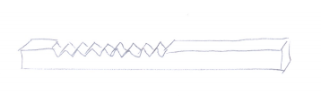
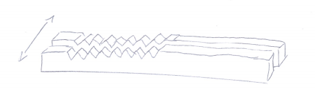
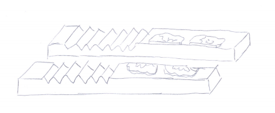

**A preliminary reading before proceeding to hashes. Illustrate the usefulness of fingerprints.**

Once, there were no accounting books. In fact, most people were illiterate and wouldn't know what to do with an accounting book if there were given one.

But given that that debts still had to be recorded somehow they would take a wooden stick, preferably from an elastic wood, like hazelwood, and cut as many notches as the number of coins owed into it. It was called a tally stick.

While this kind of tally stick is good for not forgeting the numbers, it's not immune from fraud.

Imagine that the tally stick was stored with the creditor. It would be easy for them to add more notches to the stick and demand more money from the debtor.

On the other hand, if the stick was stored with the debtor, they could have thrown it away, carve a new tally stick with less notches and claim owing less money than they actually did.

To prevent that split tally stick were used. After carving the notches the stick was split in two lengthwise and each party stored one half of it:

If the creditor added more notches to his half of the stick all the debtor had to do was to show his half of the stick and it would be obvious that the creditor was cheating and that the notches were added after the stick was split.

But splitting the stick haven't prevented either party destroying their half of the stick and making a new fake half with as many notches as they wished.

This problem was sometimes solved by adding seals to the tally stick. Each party put their seal on the tally before it was split.

Now, if you wanted to make a fake half of tally stick you would have to fake your counterparties seal which is not possible.

(Maybe there should be a preliminary chapter about seals.)

This is a funny piece of trivia: "Those tally sticks, by the way, met an unfortunate end. The system was finally abolished and replaced by paper ledgers in 1834 after decades of attempts to modernise. To celebrate, it was decided to burn the sticks - six centuries of irreplaceable monetary records - in a coal-fired stove in the House of Lords, rather than letting parliamentary staff take them home for firewood. Burning a cartload or two of tally sticks in a coal-fired stove is a wonderful way to start a raging chimney fire. So it was that the House of Lords, then the House of Commons, and almost the entire Palace of Westminster - a building as old as the tally stick system itself - was burned to the ground." (source: http://www.bbc.com/news/business-40189959)

